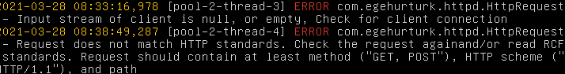

### Table of Contents
- [HTTP](#http)
  - [About](#about)
  - [Headers](#headers)
  - [Life Cycle](#life-cycle)
    - [Query Parameters](#query-parameters)
  - [Banzai](#banzai)
# HTTP

## About
Banzai is a server, specifically, a Web Server, that uses `HTTP/1.0`, and `HTTP/1.1` to communicate with the client. `HTTP/2.0` and `HTTPS` protocols are not supported, as of the current version (V1.0).

## Headers
`HTTP` protocol includes headers, *key-value* pairs, in HTTP Requests and HTTP Responses. These headers include:
* `Host`
* `Server`
* `Date`
* `Content-Language`
* `Content-Length`
* `Content-Encoding`
* and more

You can refer to [Mozilla's HTTP documentation](https://developer.mozilla.org/en-US/docs/Web/HTTP/Headers) for more information about HTTP headers.

Banzai supports for:
* `Server`
* `Host`
* `Date`
* `Content-Language`
* `Content-Length`
* `Accept` (in Requests)

An HTTP request must contain the request line, in the format:
```
METHOD PATH PROTOCOL
```

For example,

```
GET / HTTP/1.1
```

Suppose a request does not contain this request line or is wrongly formatted (not having PROTOCOL or wrong METHOD). In that case, Banzai responds with a `400 Bad Request`  HTTP response. Here're some examples of malformed requests:

`HEY / HTTP/1.1`
`GET / SMTP`
`GET /hey HTTP`
...

If the request is malformed, then Banzai logs an error to the console:



Banzai also requires the `Host` header to be included in a request. Typically, all browsers will include this header. If the `Host` header is not present in a request, Banzai will respond with a `400 Bad Request` HTTP Response.

When using the `JsonResponse` class, a request must contain:
```
Accept: application/json
```

If a request lacks this header, Banzai will respond with a `406 Not Acceptable` HTTP Response.


## Life Cycle
Banzai regulates HTTP protocol through `HttpResponse` and `HttpRequest` headers. These headers are a data structure for storing raw HTTP string from the client's `InputStream`.

`HttpResponse` and `HttpRequest` provide an abstraction over the HTTP protocol. You'll rarely need to instantiate one of these classes. You'll only encounter `HttpResponse` and `HttpRequest` in a custom class that implements `Handler`. The method `handle` takes `HttpRequest` and `HttpResponse`, and returns a `HttpResponse`.

`FileResponse`, `JsonResponse`, and `HTMLRenderer` classes provide a method to convert their content into `HttpResponse`. Here's an example:

```java

class MyHandler implements Handler {
	@Override
	public HttpResponse handle(HttpRequest req, HttpResponse res) {
            FileResponse fil = new FileResponse("/some.html", res.getStream());
            HttpResponse res = fil.toHttpResponse()
            return res;
	}
}
```
* Here, `res.getStream()` is required for any of the *response* classes discussed above (`FileResponse`, `JsonResponse`, and `HTMLRenderer`). The method returns the output stream of the client
* A `FileResponse` was instantiated and then converted into `HttpResponse` through the method `toResponse()`.

Similarly, when constructing a `JsonResponse`, you'll need the `HttpRequest` object to check if the raw HTTP request contains the header `Accept: application/json`:

```java
class MyHandler implements Handler {
	@Override
	public HttpResponse handle(HttpRequest req, HttpResponse res) {
            JsonResponse json = new JsonResponse(res.getStream(), req);
            jes.setBody("{Hello!}");
            return json;
	}
}
```
* Here, the `HttpRequest` is needed for `JsonResponse` to validate the request

### Query Parameters
Some requests may contain query parameters. These parameters are useful to pass (dynamic) information as request. Banzai supports query parameters and makes it accessible to retrieve them through `HttpRequest` object. A typical request path with query parameters is in the form of:

```
GET /path?param1=value1&param2=value2&param3=value3 HTTP/1.1
```

You can access the parameters through `HttpRequest` object's `getParameter` method. It returns an `Optional` type of `String` that contains the value (since `v1.2`):

```java
@Override
public HttpResponse handle(HttpRequest request, HttpResponse response) {
          Optional<String> fooArg = request.getParameter("foo"); // if foo does not exists as a query parameter, then the value of fooArg will be null
          String barArg = request.getParameter("bar").orElse("none"); // if bar exists, use the value; else, use "none"
          boolean bazArg = request.hasParameter("baz");
          // ...
}

```
* `request.hasParameter(String)` returns a boolean value indicating whether the parameter exists in URL as a query parameter.
* `request.getParameter(String)` returns the actual value, wrapped in `Optional<String>`, of the query parameter. If it does not exists, the `Optional` type is empty.
* If the parameter does not exists, Banzai logs a warning message

> The recommended approach to access query parameters is to first check if it is null with the `request.hasParameter(String)` method and then get the parameter's value with `request.getParameter(String)`. Directly using `request.getParameter(String)` may cause `NullPointerException` and the server does not handle that exception.
>> Since `v1.2`, There is no need to use `hasParameter` to check and then retrieve the value as `getParameter` returns an `Optional<String>` type. Any method of `Optional` can be used to check. To follow the convenience, it is recommended to use the following pattern:
\
> `request.getParameter("foo).orElse("replacement_value")`

## Banzai
As discussed above, every HTTP request contains a path. This path specifies which document has been requested and should be translated to the webroot. For example, if the webroot is `{root}/www`, then a request like `GET /hey.html HTTP/1.1` should request the file `{root}/www/hey/html`.

Banzai handles the process with the class `com.egehurturk.handlers.HttpHandler`. This class is responsible for translating the path to the local filesystem and retrieving the requested document, then sending the content as a `HttpResponse`.


However, Banzai is not limited to requesting documents with the name of the document in the path. You can map certain paths to certain `Handler`s. A handler is a class that implements the `com.egehurturk.handlers.Handler` interface. Every class that implements this interface must override the method `HttpResponse handle(HttpRequest, HttpResponse)`. With this method, you can return any file with the help of `ResponseType` classes:
* `FileResponse`
* `JsonResponse`
* `HTMLRenderer`

You can also build up your own response with `HttpResponseBuilder`.

To allow the server to use custom paths, call the method:

```java
server.allowCustomURLMapping(true)
```

Priority levels when a path is requested are:
1. Banzai looks for custom paths
2. if a `Handler` is not found, then Banzai uses the default `HttpHandler` handler to handle paths.

For example, when you enter `/hey.html`, Banzai, firstly, looks for a `Handler` that its URL is `/hey.html`. If a `Handler` does not exist, Banzai looks for a document named `hey.html` under the webroot. If the document is not found, a `404 Not Found` response is sent.

You can add a custom `Handler` to the server by calling its `addHandler` method:

```java
httpServer.allowCustomURLMapping(true);
httpServer.addHandler(Methods.GET , "/hello", new MyHandler());
```
* `Methods.GET` defines that the handler is accessible with a `GET` request.
  * :warning: Banzai does not support `POST` and other types of request methods as of **v1.0**
* `"/hello"` is the custom path mapped with `MyHandler`
  * I.e., when the client requests `/hello`, then `MyHandler` gets called
  * Note that every path must start with `"/"`
* `new MyHandler()` is your handler associated with the path `"/hello"`

and the `MyHandler` handler:

```java
class MyHandler implements Handler {
        @Override
        public HttpResponse handle(HttpRequest request, HttpResponse response) {
            HttpResponse res = new HttpResponseBuilder().scheme("HTTP/1.1")
                    .code(200)
                    .message("OK")
                    .body("<h1>Hello</h1>".getBytes())
                    .setStream(new PrintWriter(response.getStream(), false))
                    .setHeader(Headers.CONTENT_LENGTH.NAME, ""+("<h1>Hello</h1>".length()))
                    .setHeader(Headers.CONTENT_TYPE.NAME, "text/html")
                    .build();
            return res;
        }
    }
```
* This is an example of returning a custom `HttpResponse`. However, you can (and should) use `FileResponse` or other `ResponseType`s whenever possible.

When you run the server and open the path `/hello`, you'll see `<h1>Hello</h1>` as HTML.


