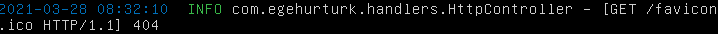
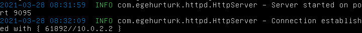
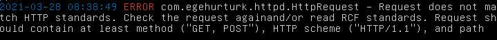
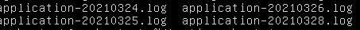
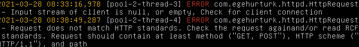

# Logging

Banzai logs errors, information messages, and debug statements to stdout and files. 

### `stdout`
Any information messages (`logger.info`) and debug messages (`logger.debug`) will be printed to console (stdout). These messages include:

HTTP Requests:

Server information:

Error messages:

### File Appender
Any error message is going to be stored in a log file inside the directory `logfiles` created by server. This file will be in the same directory with your maven project if you run Banzai with maven. The file name will be `application-{date}.log`:

Here's the contents of the log files:

Logging configuration for Banzai is under `src/main/resources/log4j.xml`
